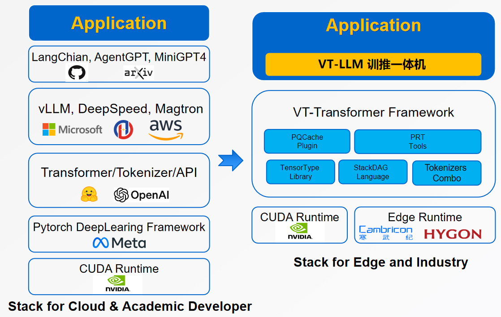

# vt-transformer
基于C++开发，面向边缘和端，训推一体的大模型开发框架。

A new transformer framework for edge computing.

### 为什么开发一款新的 Transformer 框架 ？
 
以 HuggingFace Transformer 为代表的大模型框架主要服务算法研究者，适用于云端环境，对边缘和端不友好，难以在复杂的边端软硬件环境中落地。

VT-Transformer 就是一个面向边端环境，整体的、精简的、大模型应用开发栈框架，其主要特点：

+ 完全用 C++ 开发，彻底抛弃 Python，易移植，易部署
+ 注重整体优化，通过精简的开发栈，让大模型应用快速支持新硬件，无需层层移植适配
+ 两种典型应用模式：单机单卡低延迟推理，单机8卡训推一体
+ 支持Q4/Q8量化计算，KV Cache管理等优化和实用功能
+ 高性能，稳定，强确定性

 

---

### 近期目标：完成下面的适配表格，推动国产硬件在边端环境下的应用

|            | 千问    | 百川     |  智源   |  零一    |  LLAMA2  | ...  |
| --------   | ------- | ------- | ------- | ------- | ------- | ------- |
| *NV T4*    | 7b/14b  | 7b/13b  |         |         |         |        |
| *NV 3080*  | 7b      |         |         |         |         |        |
| *摩尔线程*  |         |         |         |         |         |        |
| *海光DCU*   |         |        |         |         |        |        |
| *寒武纪*    |         |        |          |        |        |        |
| *壁仞*      |         |        |          |         |        |        |
| ...        |         |        |          |         |        |        |

本项目正在开发早期，欢迎贡献你的代码。
